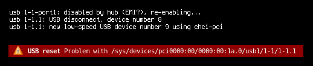

## usbwatch

This tool monitors udev events to look for USB device resets. A notification is 
shown when a reset is detected or, optionally, when added or removed.

See the manual `usbwatch(1)` for more details.
